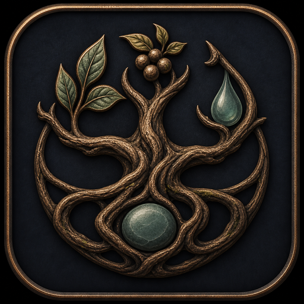

  

# Black Spirit Life

Black Spirit Life is a free Windows app I made to take some of the busywork out
of life skilling in Black Desert. Pick what you want to make and it works
backwards through the recipe chain, showing what to craft and what you still
need to get.

The planner and resource map live in the same app, so you can jump from a
missing material to gathering spots, worker nodes, or NPC vendors when those
options are available.

[**Download the latest installer**](https://github.com/Sanitee/black-spirit-life/releases/latest/download/BlackSpiritLifeInstaller.exe)
· [Release notes](https://github.com/Sanitee/black-spirit-life/releases/latest)

## What it can do

- Plan Cooking, Alchemy, and Processing using your inventory, mastery, recipe
  variants, and expected output.
- Break large crafting chains into a saved **Craft Queue** and **Need First**
  list.
- Search the Recipe Book by recipe or ingredient and review materials,
  alternatives, effects, and item uses.
- Find gathering spots, worker nodes, and NPC vendors on the built-in map.
- Turn missing materials into a checklist or a CP-aware worker-node plan.
- Keep your favorites, progress, profile settings, and appearance choices
  between sessions.

## Install

Black Spirit Life requires 64-bit Windows 10 or 11.

1. Download `BlackSpiritLifeInstaller.exe` from the link above.
2. Run it and choose where to install the app.
3. Complete the short first-time setup.

The app is not code-signed yet, so Windows may show an unknown-publisher or
SmartScreen warning. Only use the installer from the official release page;
GitHub's automatic “Source code” downloads are not the installer.

Once installed, future updates can be downloaded and installed from the update
bar inside the app without opening a browser.

## Your data

Your inventory, mastery, LT, plans, favorites, checklist, and settings are kept
locally, separate from the application. You can see or move the folder from
**Craft Profile**, and normal updates keep it in place.

A fresh install starts with an empty personal profile. It does not automatically
copy data from Beta, an older planner, or another person.

## Credits and help

Black Desert and its game content belong to Pearl Abyss. Community research and
map sources—including BDO Codex, BDOLytics, Workerman/Shrddr,
SomethingLovely, and bdo-empire—are credited in
[Asset Sources](ASSET_SOURCES.md) and
[Third-Party Notices](THIRD_PARTY_NOTICES.md).

> This is unofficial content which contains copyrighted materials and IP from
> Pearl Abyss, and is not official/endorsed content.

Black Spirit Life is free and noncommercial. The root [license](LICENSE)
covers the original app code only.

Found something wrong or need help?
[Open an issue](https://github.com/Sanitee/black-spirit-life/issues).
Technical details are kept in [docs](docs/) and the
[Resource Map guide](docs/resource-map/README.md).
